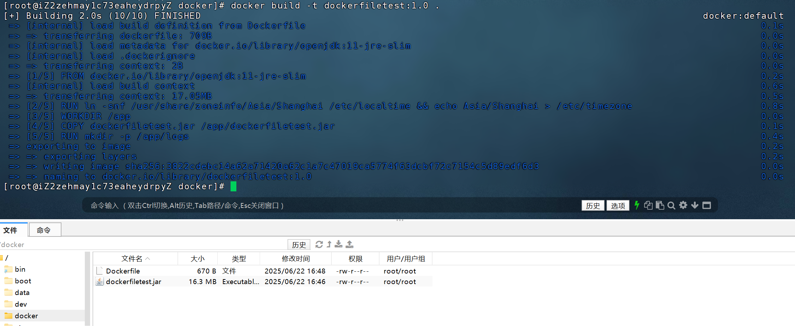
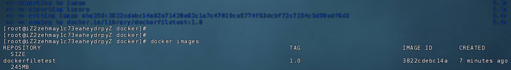
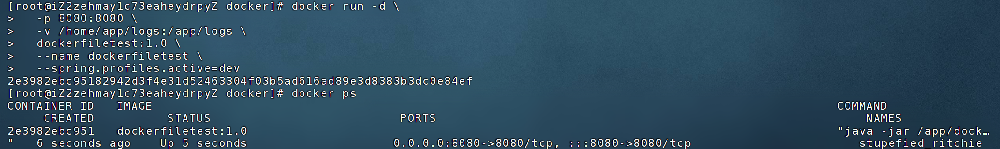
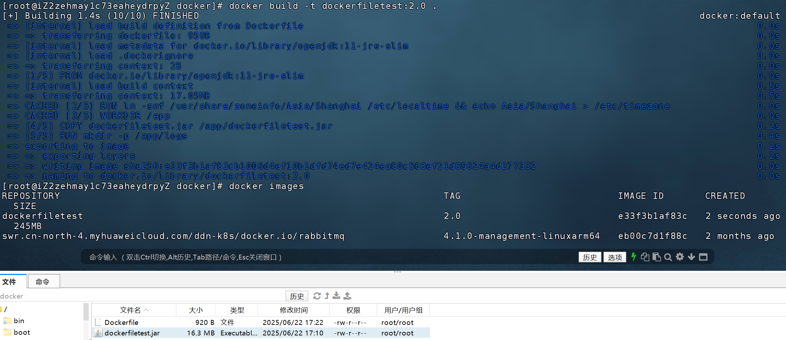
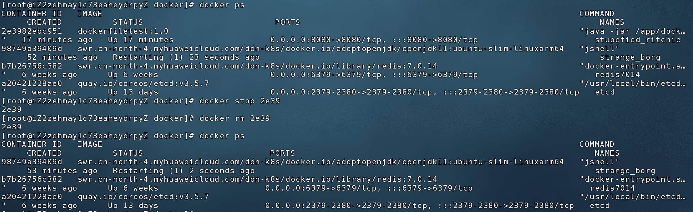
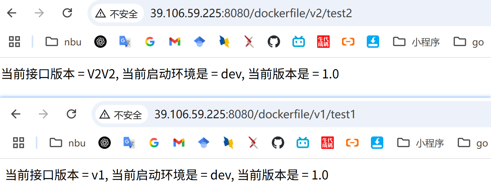
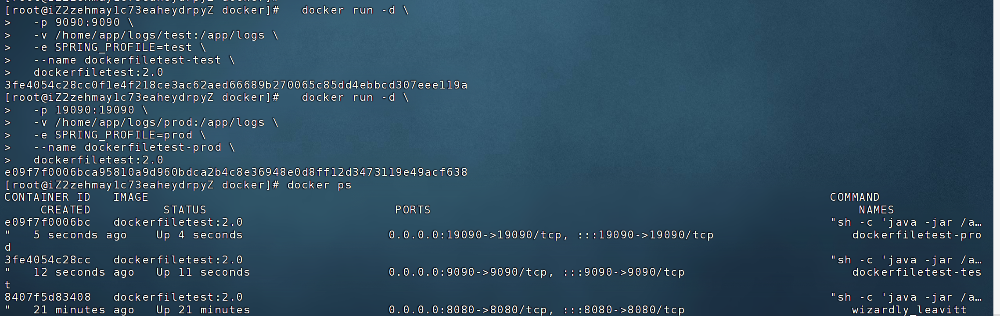

# DockerFileTest

docker部署jar包练习


# 一、第一次启动容器

## 1.1、准备一个 SpringBoot 项目

写一个测试接口，这里以DockerFileTest项目为例，并且准备好三个环境文件

## 1.2、编写 Dockerfile

详细内容请看：[Dockerfile](Dockerfile)文件。

注意：jar包的名称必须消息

## 1.3、将打包好的jar包和写好的 Dockerfile 都上传到服务器

这里在服务器上创建了一个docker的文件夹来存。

注意：Dockerfile和jar包必须放在同一级目录


## 1.4、docker安装jdk环境

构建镜像之前必须先在docker里面安装jdk环境：`openjdk:11-jre-slim`，使用官方提供的jdk镜像，

```docker pull openjdk:11-jre-slim```


## 1.5、构建应用镜像

使用`docker build`命令构建：

```shell
docker build -t dockerfiletest:1.0 .
```




查看构建好的镜像
```shell
docker images
```




## 1.6、启动容器

```shell
  docker run -d \
  -p 8080:8080 \
  -v /home/app/logs:/app/logs \
  -e SPRING_PROFILE=dev \
  --name dockerfiletest-test \
  dockerfiletest:2.0
```




## 1.7、测试是否能访问

http://39.106.59.225:8080/dockerfile/v1/test1


# 二、后续版本更新

## 2.1 准备好新的jar包

如dockerfiletest.jar

## 2.2 将jar包和dockerfile上传服务器

将jar包和dockerfile上传到服务器的同样目录，`/docker`

## 2.3 构建新应用镜像

使用`docker build`命令构建：

```shell
docker build -t dockerfiletest:2.0 .
```

查看构建好的镜像
```shell
docker images
```




## 2.4、停止并删除旧容器

```shell
docker ps

docker stop 2e39

docker rm 2e39

docker ps
```



## 2.5、使用2.0版本的镜像重启容器

```shell
  docker run -d \
  -p 8080:8080 \
  -v /home/app/logs:/app/logs \
  -e SPRING_PROFILE=dev \
  --name dockerfiletest-test \
  dockerfiletest:2.0
```


## 2.6、测试是否能访问

http://39.106.59.225:8080/dockerfile/v1/test1
http://39.106.59.225:8080/dockerfile/v2/test2



## 2.7、运行测试环境和生成环境


测试
```shell
  docker run -d \
  -p 9090:9090 \
  -v /home/app/logs/test:/app/logs \
  -e SPRING_PROFILE=test \
  --name dockerfiletest-test \
  dockerfiletest:2.0
```

生产
```shell
  docker run -d \
  -p 19090:19090 \
  -v /home/app/logs/prod:/app/logs \
  -e SPRING_PROFILE=prod \
  --name dockerfiletest-prod \
  dockerfiletest:2.0
```




## 1.8、如果旧版本镜像过多了，注意删除一些


# 三、脚本构建

由于上述一条一条命令的构建方式太慢了，对线上的使用不友好。

因此，下面将使用shell脚本和docker-compose的方式一键部署

## 3.1、使用shell脚本

```shell
#!/bin/bash

APP_NAME="dockerfiletest"
VERSION=$1
PORT=8080
PROFILE="dev"
JAR_NAME="dockerfiletest.jar"
LOG_DIR="/home/app/logs"
CONTAINER_NAME="${APP_NAME}-${PROFILE}"

# 参数校验
if [ -z "$VERSION" ]; then
  echo "❌ 请输入版本号，例如: ./update.sh 2.0"
  exit 1
fi

echo "🚀 构建镜像: ${APP_NAME}:${VERSION}"
docker build -t ${APP_NAME}:${VERSION} .

echo "🛑 停止并删除旧容器: ${CONTAINER_NAME}"
docker stop ${CONTAINER_NAME} 2>/dev/null
docker rm ${CONTAINER_NAME} 2>/dev/null

echo "🧼 创建日志目录: ${LOG_DIR}"
mkdir -p ${LOG_DIR}

echo "🏃 启动新容器: ${CONTAINER_NAME}"
docker run -d \
  -p ${PORT}:${PORT} \
  -v ${LOG_DIR}:/app/logs \
  -e SPRING_PROFILE=${PROFILE} \
  --name ${CONTAINER_NAME} \
  ${APP_NAME}:${VERSION}

echo "✅ 部署完成！当前运行版本: ${VERSION}"
```

## 3.2、使用 docker-compose 管理版本升级（推荐团队使用）

docker-compose.yml

```yaml
version: "3.8"

services:
  myapp:
    image: dockerfiletest:2.0
    container_name: dockerfiletest-dev
    ports:
      - "8080:8080"
    volumes:
      - /home/app/logs:/app/logs
    command: ["java", "-jar", "/app/myapp.jar", "--spring.profiles.active=dev"]

```
